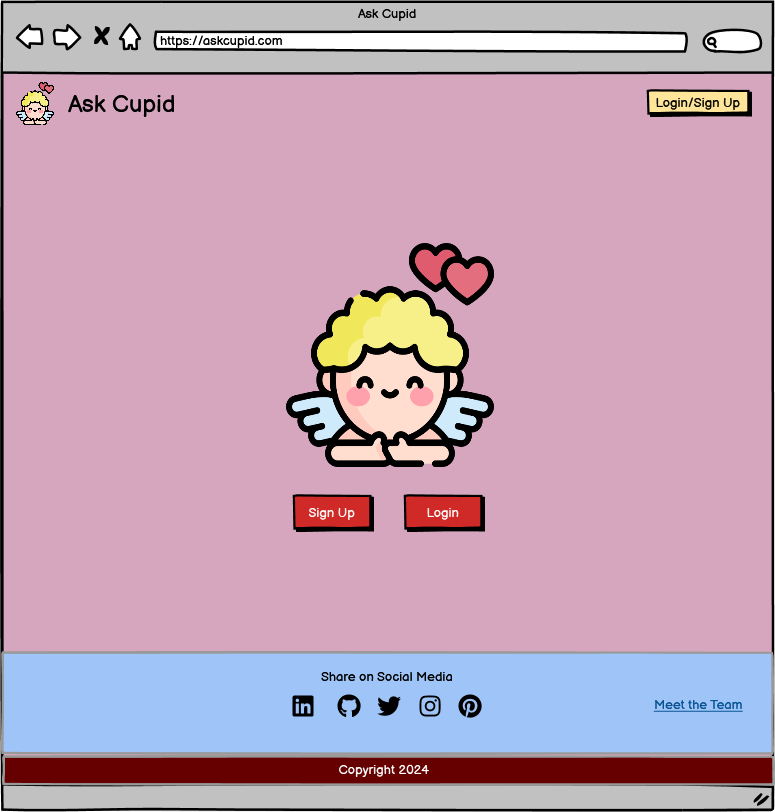

# Welcome to Ask Cupid :heart:

# Team2's Hackathon App

Welcome to Team2's app for the Hackathon competition — an extraordinary venture that aims to elevate your connections and redefine your gifting experiences. Our app goes beyond the ordinary, providing tailored suggestions for both gifts and dreamy holiday destinations.

**Introducing Ask Cupid!** Your ultimate companion for creating unforgettable moments. Whether you're searching for the perfect gift or planning a dreamy holiday, Ask Cupid is here to inspire and guide you.

## What Ask Cupid Offers:

- **Tailored Gift Suggestions:**
  - Receive personalized recommendations for gifts that will leave a lasting impression.

- **Dreamy Holiday Destinations:**
  - Explore curated suggestions for unforgettable holiday destinations, designed just for you.

## How to Get Started:

What are you waiting for? Sign up now, enter your partner's information, and let Ask Cupid be the catalyst for your next unforgettable experience. Embrace the journey, connect deeply, and make every moment count!

**Ready to create magic? Join us and let's make this Hackathon a journey to remember!**

# Content

**Table of content:**

- [Introduction](#introduction)
- [Am I Responsive](#responsive)
- [UX](#ux)
  - [The Strategy](#the-strategy)
  - [The Scope](#the-scope)
  - [The Structure](#the-structure)
  - [The Skeleton](#the-skeleton)
  - [The Surface](#the-surface)
- [User Experience](#user-experience)
  - [First Time User](#first-time-user)
  - [Returning User](#returning-user)
  - [Frequent User](#frequent-user)
  - [Design](#design)
- [Features](#features)
- [Language](#language)
  - [Tools](#tools)
  - [Frameworks & Libaries](#frameworks-libaries)
- [Testing](#testing)
  - [Manual Testing](#manual-testing)
  - [Lighthouse](#lighthouse)
  - [Browser Test](#browser-test)
  - [Validation](#validation)
  - [Bugs](#bugs)
- [Deployment](#deployment)
  - [Deployment To Github](#deployment-to-github)
  - [Deployment to Heroku](#heroku-deployment)
- [Credit](#credit)
  - [Content](#credit-content)
  - [Images](#images)
  - [Thank You](#thank-you)
- [The Team](#team)

### Am I Responsive?

## UX

### The Strategy

- The primary goal of the Ask Cupid app's initial version is to enhance romantic connections through a strong emphasis on detailed partner profiles.
- The strategy centers around providing users with a platform to create comprehensive profiles that reflect their personalities, interests, and relationship preferences.
- This approach aims to lay the foundation for meaningful and personalized interactions, setting the stage for deeper connections.

### The Scope

- The core scope of the first version revolves around users creating detailed profiles specifically for their partners.
- Users are encouraged to share comprehensive information about their partners, fostering a more profound understanding of their personalities and preferences.
- While the initial release focuses on text-based interactions, future iterations may extend to incorporate multimedia elements for a richer user experience.

### The Structure

- The app structure prioritizes the creation of detailed partner profiles as the central feature.
- User-friendly interfaces guide users through the partner profile creation process, ensuring a seamless and enjoyable experience.
- Conversation starters and personalized suggestions complement the partner profile-centric structure, offering avenues for engaging interactions.

### The Skeleton

- Wireframes were crafted with a strong emphasis on the partner profile creation process, ensuring a user-friendly and intuitive design.
- The wireframes provide a strategic visualization, highlighting the importance of detailed partner profiles in the app's structure.

  - [View More Wireframes](src/assets/wireframes)

  

### The Surface

### Technology Stack

The Ask Cupid app is built using a modern and robust technology stack, combining the power of React and Django to deliver a seamless and feature-rich user experience.

- **Frontend:** Developed with React, the app boasts a clean and visually appealing interface, providing an intuitive layout for users.

- **Backend:** Powered by Django, our backend ensures the efficient processing of data, contributing to the app's commitment to facilitating genuine connections and meaningful conversations.

These technologies work in harmony to create a space where users can delve into the intricacies of their partners' personalities, building a foundation for lasting and authentic relationships.
- A modern and intuitive layout encourages users to create detailed profiles for their partners, fostering a sense of authenticity and depth in the connections made through the app.
- The decision to prioritize partner profiles underscores the app's commitment to facilitating genuine connections and meaningful conversations.
- This intentional design choice aims to create a space where users can delve into the intricacies of their partners' personalities, building a foundation for lasting and authentic relationships.

# User Experience

### First Time User

- As a first-time user, I'd like to easily see where I can sign up so I can get started.
There should be a prominent and easily accessible "Sign Up" button on the landing page.
The sign-up process should be straightforward with clear instructions.
Minimal required information during sign-up to encourage a quick and hassle-free onboarding experience.

- As a first-time user, I'd like to feel welcomed to the site so I'd feel the desire to come back.
The landing page should feature a warm and inviting design with visually appealing elements.
Upon successful sign-up, the user should receive a personalized welcome message or prompt.
Clear navigation cues and tooltips should guide the user to explore key features and sections.

- As a first-time user, I'd like instructions on what to do so I can get started quickly.
Provide an onboarding tutorial or guide that highlights key features and how to navigate the app.
Include tooltips or pop-ups explaining the purpose of each section or button.
Offer a "Getting Started" section with concise instructions on creating the first partner profile and initiating a conversation.

### Returning User

- As a returning user, I'd like to see the results for my previous profiles so I can reflect on past .
Provide a clear and easily accessible "View Results" or "Previous Profiles" section.
Display a summary or detailed view of the results from past partner profiles.
Include an option to revisit and edit previous profiles if desired.

- As a returning user, I'd love to be able to input my own info as well so I can make the experience more real and personalized.
Enable users to easily navigate to the "Create Profile" section.
Provide an option to input and save personal information to create their own profiles.
Allow users to switch seamlessly between creating profiles for others and creating profiles for themselves.

### Frequent User

- As a frequent user, I'd love to see more categories so I can get a more precise result.
Expand the range of categories available for creating partner profiles.
Include options for specific interests, hobbies, and lifestyle preferences.
Enhance the algorithm to provide more nuanced and precise match results based on the additional categories.

- As a frequent user, I'd like to match myself with different partners and see which matches the best.
Introduce a "Match Yourself" feature where users can simulate matches with various partner profiles.
Display a compatibility score or summary for each simulated match.
Allow users to compare results and gain insights into compatibility patterns.

- As a frequent user, I'd like our song to be displayed so I can add a personalized touch to my interactions.
Include an option for users to set a personalized "Our Song" for each partner profile.
Display the chosen song prominently within the partner profile or during interactions.
Allow users to change or update their chosen song for a dynamic and personalized experience.

<a id="design">

### Design

<a id="features">

#  Features